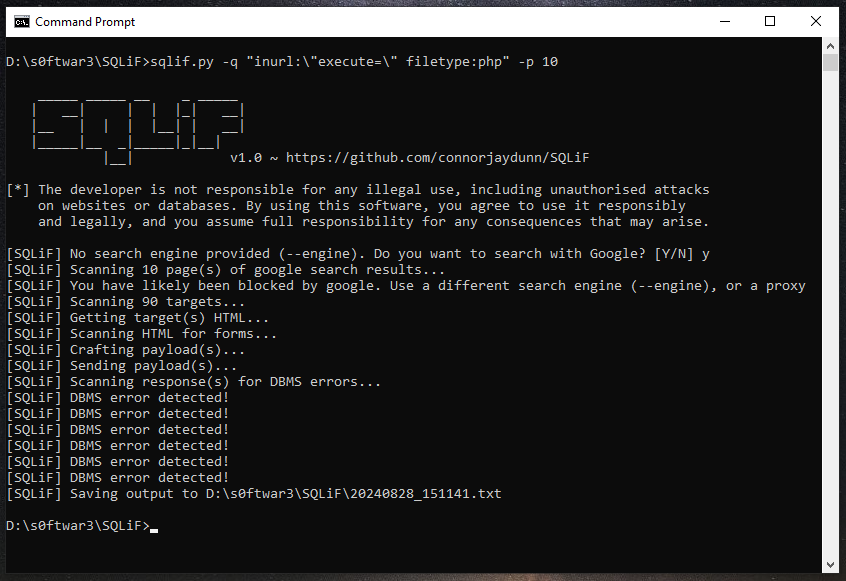

# SQLiF

SQLiF (SQL injection Finder) is an open-source penetration testing tool designed to automate the detection of SQL injection vulnerabilities. SQLiF only detects vulnerabilities, it will **not** exploit them.

Features
----

* Fast Asynchronous Requests
* URL SQLi Vulnerability Testing
* GET & POST Form SQLi Vulnerability Testing
* Error-Based SQLi
* _Time-Based SQLi (soon)_
* _Blind-Based SQLi (soon)_
* _Recursive Scanning (soon)_
* Targeted Scanning
* Detection for many popular DBMS (MySQL, PostgreSQL, Microsoft SQL Server, and more)
* Dork-Based Scanning (Google, Yahoo, Bing, and more)

Screenshots
----



Installation
----

**1.** Git clone the repository:

```bash
git clone https://github.com/connorjaydunn/SQLiF.git
```

**2.** Install the required python libraries:

```bash
cd SQLiF
pip install -r requirements.txt
```

Usage
----

To get a list of all options use:

```bash
python sqlif.py -h
```

Examples
----

Targeted scanning & output file:

```bash
python sqlif.py -t "https://127.0.0.1/blog.php?id=23" -o "output.txt"
```

Dork scan of 2 pages with the google search engine:

```bash
python sqlif.py -e "google" -q "inurl:login.php" -p 2
```

TODO
----

* Time-Based SQL injection detection
* Blind-Based SQL injection detection
* Recursive scanning (i.e. follow links found in target's html response)
* Improved exception handling (virtually none as of right now)
* Improved output (both console and output file)
* ~~Faster DBMS error detection (current implementation is extremely slow in some cases and so detection of a few engines is disabled)~~
* Fix "ConnectionResetError: [WinError 10054] An existing connection was forcibly closed by the remote host" error

DISCLAIMER
----

The developer is not responsible for any illegal use, including **unauthorised** attacks on websites or databases. By using this software, you agree to use it responsibly and legally, and **you assume full responsibility** for any consequences that may arise.