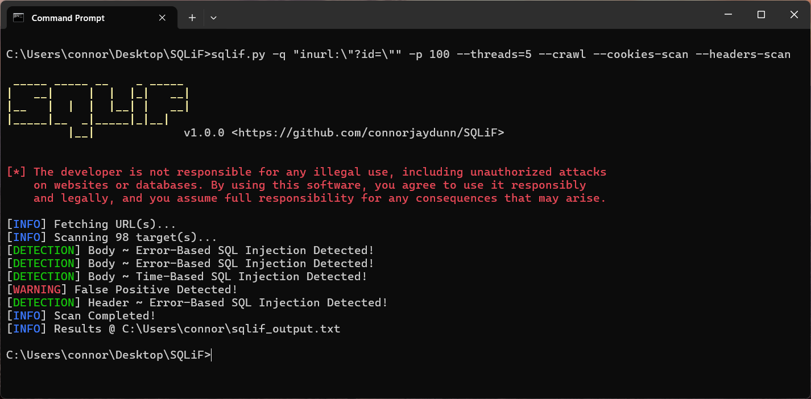

# SQLiF

SQLiF (SQL injection Finder) is an open-source penetration testing tool designed to automate the detection of SQL injection vulnerabilities. SQLiF only detects vulnerabilities, it will **not** exploit them.

Features
----

* GET & POST Form SQLi Vulnerability Testing
* Error-Based SQLi
* Time-Based SQLi
* Cookie-Based SQLi
* Header-Based SQLi
* Recursive Scanning
* Targeted Scanning
* Detection For Many Popular DBMS (MySQL, PostgreSQL, Microsoft SQL Server, and more)
* Dork-Based Scanning

Screenshots
----



Installation
----

**1.** Clone the repository:

```bash
git clone https://github.com/connorjaydunn/SQLiF.git
```

**2.** Install dependencies:

```bash
cd SQLiF
pip install -r requirements.txt
```

Usage
----

To view all available options and parameters, run:

```bash
python sqlif.py -h
```

Examples
----

Targeted scan with cookie and header-based injection:

```bash
python sqlif.py -t "https://127.0.0.1/blog.php?id=23" --cookies-scan --headers-scan
```

Google search results scan (start index 20 and 30 results total) using 3 threads and recursive scanning.

```bash
python sqlif.py -q "inurl:login.php" -s 20 -n 30 --threads=3 --crawl
```

DISCLAIMER
----

The developer is not responsible for any illegal use, including **unauthorised** attacks on websites or databases. By using this software, you agree to use it responsibly and legally, and **you assume full responsibility** for any consequences that may arise.